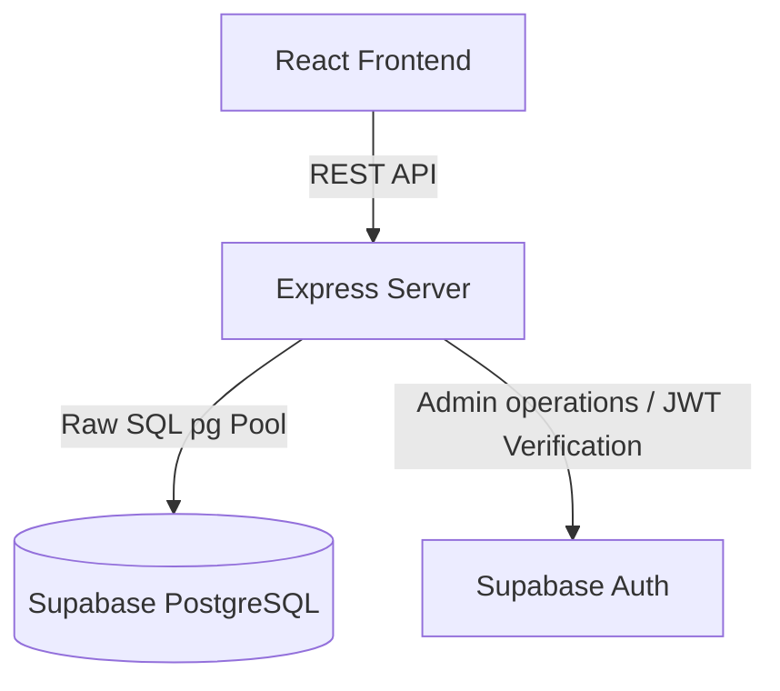

# Monthly Duty Doctor Roster Application

A clean-architecture, production-ready scheduler for managing and generating medical duty shift rosters. Built using Node.js + Express, raw SQL queries on PostgreSQL (Supabase), and React + Vite.

---

## Architecture Overview



### Key Architectural Decisions:
1. **Raw SQL Operations**: We bypass ORMs for performance, full control over transaction rollbacks, query plan index tuning, and to avoid ORM overhead in mathematical round-robin calculations.
2. **Score-based Schedular Algorithm**: Distributes shifts fairly using a dynamic scoring model. Factors include total hours/shifts worked, and a high-penalty system for consecutive night/morning duties or double shifts on the same calendar day.
3. **Database Safeguards**: Uses a transaction to remove generated base duties while protecting any manual scheduler overrides (`is_override = true`) when recalculating.
4. **Future Scalability**:
   - **Multi-Hospital/Department Support**: Easily add a `department_id` foreign key constraint to `doctors`, `duty_shifts`, and `roster_entries` for multi-tenant isolation.
   - **Notifications System**: Built-in `created_by` audit fields allow hooks to push instant SMS/email alerts via services like Twilio or SendGrid.

---

## Directory Structure

```text
/
├── database/            # SQL scripts for database schema & initialization
│   ├── schema.sql       # Table structures, checks, unique constraints & indexes
│   └── seed.sql         # Seed data (doctors, standard duty shifts)
│
├── backend/             # Express.js REST API Server
│   ├── src/
│   │   ├── config/      # DB connection pool (pg) & Supabase config
│   │   ├── controllers/ # Express route controllers (CRUD, generators, exports)
│   │   ├── middleware/  # JWT Auth & Security filters
│   │   ├── services/    # Roster scheduling algorithm
│   │   └── server.ts    # Application entry point
│   ├── .env.example
│   └── tsconfig.json
│
└── frontend/            # React + Vite Client
    ├── src/
    │   ├── components/  # Layouts and Overrides Modal
    │   ├── pages/       # Dashboard Calendar and Doctor CRUD Manager
    │   ├── lib/         # API integration client
    │   ├── types/       # Shared TS Interfaces
    │   └── main.tsx
    ├── tailwind.config.js
    └── tsconfig.json
```

---

## Setup Instructions

### 1. Database Setup (Supabase)
1. Go to [Supabase](https://supabase.com/) and create a new project.
2. Navigate to the **SQL Editor** in the Supabase Dashboard.
3. Paste the contents of [database/schema.sql](file:///c:/Projects/Doctor_Roster_Application/database/schema.sql) and run it to create tables & indexes.
4. Paste the contents of [database/seed.sql](file:///c:/Projects/Doctor_Roster_Application/database/seed.sql) and run it to seed initial shifts and doctors.

### 2. Backend Setup
1. Open your terminal and navigate to the backend directory:
   ```bash
   cd backend
   ```
2. Install dependencies:
   ```bash
   npm install
   ```
3. Copy `.env.example` to `.env` and fill in your Supabase connection strings:
   ```bash
   cp .env.example .env
   ```
   - Set `DATABASE_URL` to your Supabase Transaction Pooler URL.
   - Set `SUPABASE_URL` and `SUPABASE_SERVICE_ROLE_KEY`.
4. Run the database seed script locally (optional if done in SQL Editor):
   ```bash
   npm run seed
   ```
5. Start the backend development server:
   ```bash
   npm run dev
   ```
   *The server runs by default on `http://localhost:5000`.*

### 3. Frontend Setup
1. Navigate to the frontend directory:
   ```bash
   cd ../frontend
   ```
2. Install dependencies:
   ```bash
   npm install
   ```
3. Start the Vite React client development server:
   ```bash
   npm run dev
   ```
   *The application will launch on `http://localhost:3000`.*

---

## Developer / Bypass Authentication Mode
To simplify testing without registering accounts in Supabase Auth immediately:
- The backend features a development bypass.
- If the configuration is set to `placeholder.supabase.co`, the frontend sends a header token `dev-token` which the backend logs as user `dev@paramhealth.local`.
- This gives developers instant access to try all administrative operations (creating doctors, triggering schedulers, applying overrides) immediately out-of-the-box.
